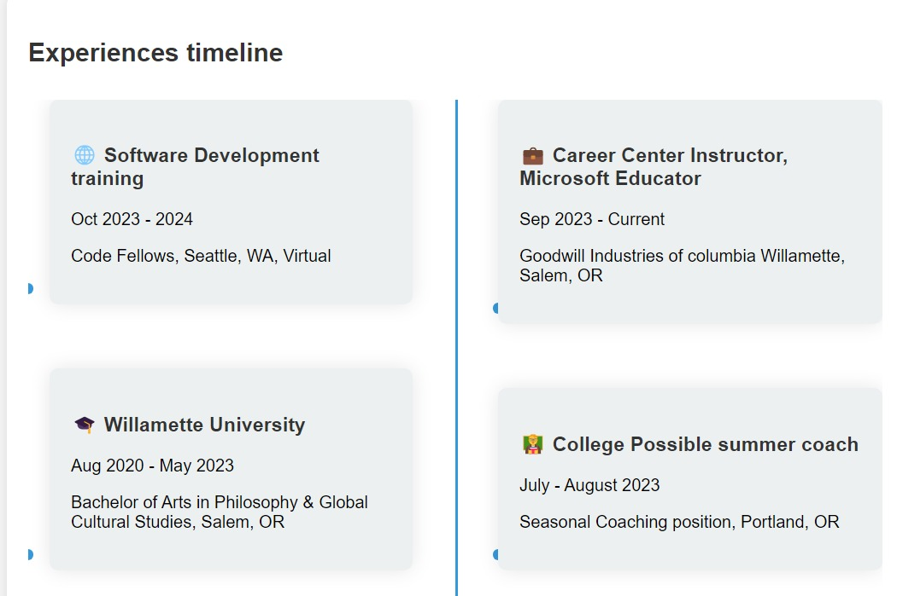

# Resume Timeline

This project showcases a dynamic resume timeline with smooth animations and interactive elements, designed to provide a comprehensive overview of my professional journey and skill set.

## Overview

The resume timeline website was developed to visually present my career progress, projects, education, and skills. It uses animations to highlight each timeline item as the user scrolls, creating an engaging user experience.

### Live Demo

Check out the deployed website: [Resume Timeline](https://qilinxie02.github.io/resume-timeline/)

preview of page:

## Features

- **Dynamic Animations:** Timeline items animate into view as the user scrolls.
- **Responsive Design:** Optimized for various devices and screen sizes.
- **Interactive Elements:** Hover effects and clickable links to detailed sections.

## Technologies Used

- **HTML**
- **CSS**
- **JavaScript**
- **Font Awesome**
- **LinkedIn Badges**
- **Chart.js** (for additional data visualization)

## Usage

1. **Scroll Animations:** Timeline items animate into view as you scroll down the page.
2. **Interactive Links:** Clickable links on each timeline item redirect to detailed pages or external resources.
3. **Dark Mode Toggle:** Use the toggle button to switch between dark and light modes.

This color picking website was very helpful when synchronizing colors on this page: https://redketchup.io/color-picker